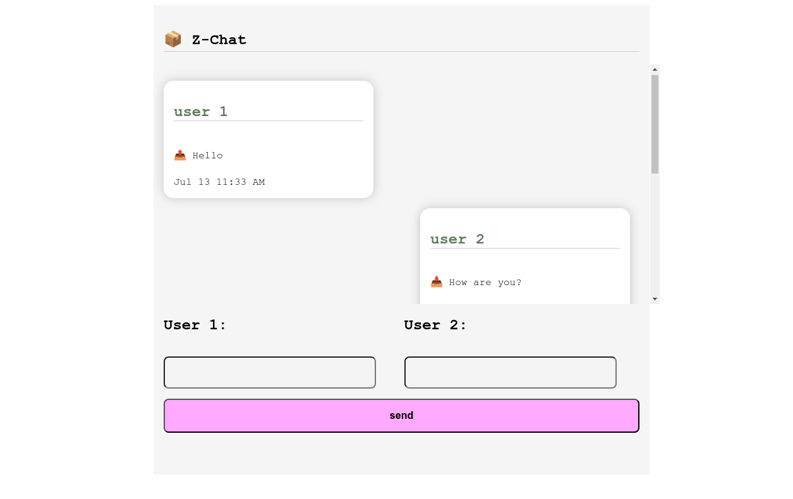

# 📦 Z-Chat

> v.0.0.1, Notorius

Little Demo chat application using [socket.io](https://socket.io/) and [z-js-framework](https://github.com/javaScriptKampala/z-js) on frontend



💡 Purely made for demo purposes, just for fun, but you can contribute in we make it funnier!

## Installing And Having It Running

install needed stuff, in client directory just run

``` bash
npm install
```

And then install vite to help you run the app, in case you don't have it, you can also use any http server...

```bash
npm install -g vite
```

then still in client run

```bash
vite dev
```

and finally in server directory run `npm install` and then `node index.js` to start the server, that's it.

## 😇 Want to contribute?

Well, this is still work in progress and fun. I am working on it in my little free time, so if you have other ideas or what, reach out to me at [hssnkizz@gmail.com](hssnkizz@gmail.com)
